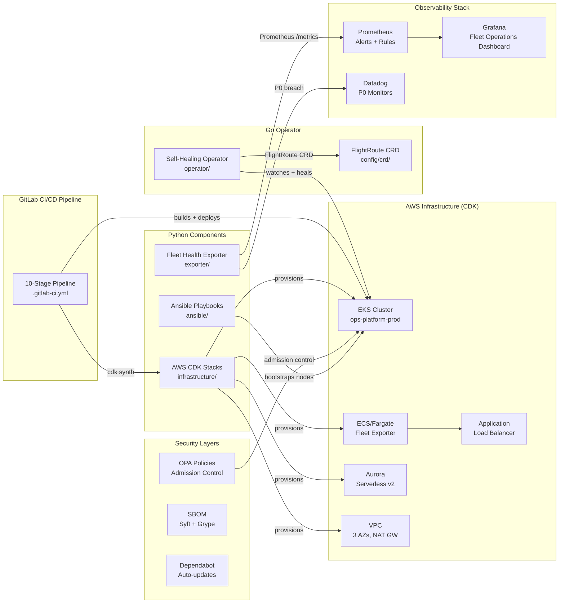

# ops-platform

> Self-Healing Cloud Operations Platform — a production-grade portfolio project demonstrating the operational backbone of a 24/7 global flight booking platform. **For educational and portfolio purposes only.**

[](https://github.com/kumarrajapuvvalla-bit/ops-platform/actions/workflows/exporter-ci.yml)
[](https://github.com/kumarrajapuvvalla-bit/ops-platform/actions/workflows/operator-ci.yml)
[](https://github.com/kumarrajapuvvalla-bit/ops-platform/actions/workflows/cdk-ci.yml)

## 🚀 Quick Start (No AWS Required)

```bash
git clone https://github.com/kumarrajapuvvalla-bit/ops-platform.git
cd ops-platform
docker-compose up -d

# ✔ Grafana dashboard: http://localhost:3000  (admin/admin)
# ✔ Prometheus:        http://localhost:9090
# ✔ Fleet metrics:     http://localhost:8000/metrics
```

The full observability stack starts in under 2 minutes with zero AWS credentials.
Grafana auto-provisions the Fleet Operations dashboard on first boot.

---

## Architecture Overview



## Components

| Component | Language | Path | Purpose |
|-----------|----------|------|---------|
| Fleet Health Exporter | Python | `exporter/` | Custom Prometheus exporter polling EKS/ECS/ALB/RDS, calculates Fleet Readiness Score |
| Self-Healing Operator | Go | `operator/` | Kubernetes controller-runtime operator watching `FlightRoute` CRDs and auto-healing replica drift |
| AWS CDK Infrastructure | Python | `infrastructure/` | All AWS infra as code — VPC, EKS, ECS/Fargate, ALB, Aurora Serverless v2, IAM |
| GitLab CI/CD Pipeline | YAML | `.gitlab-ci.yml` | 10-stage pipeline: lint → test → synth → scan → build → package → dev → integration → prod → notify |
| Ansible | YAML + Python | `ansible/` | EKS node bootstrap, CIS L1 hardening, Datadog + node_exporter installation |
| Helm Chart | YAML | `helm/ops-platform/` | Kubernetes packaging for both services with HPA, PDB, ServiceMonitor |
| OPA Policies | Rego | `policies/` | Admission control: resource limits, non-root, required labels |
| Observability | YAML + JSON | `observability/` | Prometheus alerts, SLO definitions, Grafana dashboards, Datadog monitors |
| Runbooks | Markdown | `runbooks/` | Structured P0/P1 incident response procedures |
| Postmortems | Markdown | `postmortems/` | Blameless postmortems with UTC timelines and action items |
| ADRs | Markdown | `docs/adr/` | Architecture Decision Records for key technical choices |

## Tech Stack

| Layer | Technology |
|-------|------------|
| Cloud | AWS (EKS, ECS/Fargate, ALB, Aurora, VPC) |
| IaC | Python AWS CDK |
| Container Orchestration | Kubernetes 1.29 (EKS) |
| Packaging | Helm 3 |
| CI/CD | GitLab CI/CD (10 stages) |
| Configuration Management | Ansible |
| Observability | Prometheus, Grafana, Datadog |
| Policy-as-Code | OPA / Gatekeeper (Rego) |
| Supply Chain Security | Syft (SBOM), Trivy, Dependabot |
| Languages | Python 3.11, Go 1.22 |
| Operator Framework | controller-runtime v0.17.0 |
| Container Base | python:3.11-slim (exporter), gcr.io/distroless/static (operator) |

## Local Development

### Prerequisites

- Docker 24+, Python 3.11+, Go 1.22+, Node.js 20+
- `kubectl` + `minikube`, `helm` 3.12+

### Full observability stack (recommended first step)

```bash
docker-compose up -d
# Grafana auto-provisions Prometheus datasource + Fleet Operations dashboard
```

### Run the Fleet Health Exporter standalone

```bash
cd exporter && docker build -t fleet-exporter:local .
docker run --rm -p 8000:8000 -e ENVIRONMENT=dev fleet-exporter:local
curl http://localhost:8000/metrics | grep fleet_readiness
```

### Run the Operator with minikube

```bash
minikube start --kubernetes-version=v1.29.0
kubectl apply -f operator/config/crd/flightroute_crd.yaml
kubectl apply -f operator/config/rbac/role.yaml
cd operator && go run main.go
```

### CDK Synth (no AWS needed)

```bash
cd infrastructure
pip install -r requirements.txt && npm install -g aws-cdk
cdk synth --context environment=dev --context account=123456789012 --context region=eu-west-2
pytest tests/ -v
```

## Further Reading

- 📐 [Architecture Deep Dive](docs/ARCHITECTURE.md) — data flows, state machines, cost estimates
- 📝 [Architecture Decision Records](docs/adr/README.md) — why CDK, distroless, controller-runtime
- 🔒 [OPA Policies](policies/README.md) — admission control closing the INC-001 loop
- 📈 [SLO Definitions](observability/slo/slo-definitions.yaml) — formal SLI/SLO as code
- 📝 [CHANGELOG](CHANGELOG.md) — version history
- 🤝 [Contributing Guide](CONTRIBUTING.md) — dev setup, commit convention, PR process

## How This Maps to a Senior DevOps / SRE Engineer Role

This project demonstrates the skills typically required for a Senior DevOps or
SRE Engineer working on 24/7 cloud-native aviation or high-availability
operations platforms.

| Skill Area | Implementation in This Repo |
|------------|-----------------------------|
| AWS (EKS, ECS/Fargate, ALB) | `infrastructure/stacks/eks_stack.py`, `fargate_stack.py` |
| Infrastructure as Code | Python AWS CDK in `infrastructure/` — same IaC principles as Terraform |
| Kubernetes operations | `operator/` — custom controller-runtime operator; `helm/` — HPA + PDB |
| Helm | `helm/ops-platform/` with templates, values, HPA, PDB, ServiceMonitor |
| GitLab CI/CD | `.gitlab-ci.yml` — 10-stage pipeline with OIDC, Trivy, manual prod gate |
| Ansible | `ansible/playbooks/` — node bootstrap, CIS hardening, Datadog agent install |
| Datadog | `exporter/datadog_bridge.py`, `observability/datadog/monitors/` |
| Prometheus + Grafana | `observability/prometheus/alerts/`, `observability/grafana/` |
| Python scripting | `exporter/fleet_exporter.py`, `health_calculator.py`, CDK stacks |
| Go development | `operator/` — full Kubernetes operator in Go |
| SLO / SRE practices | `observability/slo/slo-definitions.yaml`, Fleet Readiness Score |
| Policy-as-Code | `policies/k8s/*.rego` — OPA admission control |
| Supply chain security | SBOM workflow, Dependabot, Trivy, `.github/workflows/sbom.yml` |
| 24/7 incident response | `runbooks/` — 4 runbooks; `postmortems/` — INC-001 with UTC timeline |
| Security / DevSecOps | CIS hardening, distroless image, non-root, no wildcards in IAM |
| Kubernetes CRDs / operators | `FlightRoute` CRD with full reconciliation loop and self-healing |
| Architecture decisions | `docs/adr/` — 3 ADRs with context, decision, consequences |

## Disclaimer

This is a **portfolio and educational project**. All code is original and written
for learning and demonstration purposes only. No proprietary code, credentials,
customer data, or confidential information from any employer or company has been
used. The aviation domain is used purely as a realistic technical context.
This project is not affiliated with or endorsed by any real company or organisation.
