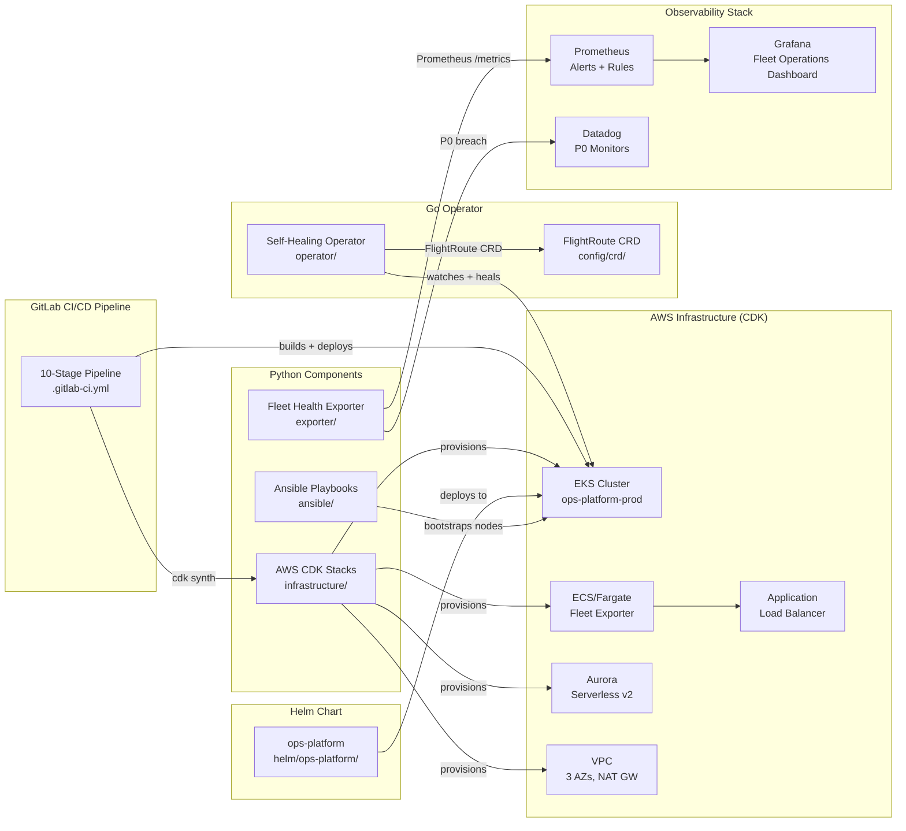

# ops-platform

> Self-Healing Cloud Operations Platform — a production-grade portfolio project demonstrating the operational backbone of a 24/7 global flight booking platform. **For educational and portfolio purposes only.**

[](https://github.com/kumarrajapuvvalla-bit/ops-platform/actions/workflows/exporter-ci.yml)
[](https://github.com/kumarrajapuvvalla-bit/ops-platform/actions/workflows/operator-ci.yml)
[](https://github.com/kumarrajapuvvalla-bit/ops-platform/actions/workflows/cdk-ci.yml)

## Architecture Overview



## Components

| Component | Language | Path | Purpose |
|-----------|----------|------|---------|
| Fleet Health Exporter | Python | `exporter/` | Custom Prometheus exporter polling EKS/ECS/ALB/RDS, calculates Fleet Readiness Score |
| Self-Healing Operator | Go | `operator/` | Kubernetes controller-runtime operator watching `FlightRoute` CRDs and auto-healing replica drift |
| AWS CDK Infrastructure | Python | `infrastructure/` | All AWS infra as code — VPC, EKS, ECS/Fargate, ALB, Aurora Serverless v2, IAM |
| GitLab CI/CD Pipeline | YAML | `.gitlab-ci.yml` | 10-stage pipeline: lint → test → synth → scan → build → package → dev → integration → prod → notify |
| Ansible | YAML + Python | `ansible/` | EKS node bootstrap, CIS L1 hardening, Datadog + node_exporter installation |
| Helm Chart | YAML | `helm/ops-platform/` | Kubernetes packaging for both services with HPA, PDB, ServiceMonitor |
| Observability | YAML + JSON | `observability/` | Prometheus alert rules, Grafana dashboards, Datadog monitor definitions |
| Runbooks | Markdown | `runbooks/` | Structured P0/P1 incident response procedures |
| Postmortems | Markdown | `postmortems/` | Blameless postmortems with UTC timelines and action items |

## Tech Stack

| Layer | Technology |
|-------|------------|
| Cloud | AWS (EKS, ECS/Fargate, ALB, Aurora, VPC) |
| IaC | Python AWS CDK |
| Container Orchestration | Kubernetes 1.29 (EKS) |
| Packaging | Helm 3 |
| CI/CD | GitLab CI/CD (10 stages) |
| Configuration Management | Ansible |
| Observability | Prometheus, Grafana, Datadog |
| Languages | Python 3.11, Go 1.22 |
| Operator Framework | controller-runtime v0.17.0 |
| Container Base | python:3.11-slim (exporter), gcr.io/distroless/static (operator) |

## Local Development

### Prerequisites

- Docker 24+
- Python 3.11+
- Go 1.22+
- Node.js 20+ (for CDK)
- AWS CLI configured
- `kubectl` + `minikube` (for operator)
- `helm` 3.12+

### Run the Fleet Health Exporter with Docker

```bash
cd exporter

# Build the image
docker build -t fleet-exporter:local .

# Run locally (metrics on port 8000)
docker run --rm -p 8000:8000 \
  -e ENVIRONMENT=dev \
  -e SCRAPE_INTERVAL=30 \
  fleet-exporter:local

# Check metrics
curl http://localhost:8000/metrics | grep fleet_readiness
```

### Run the Operator with minikube

```bash
# Start a local cluster
minikube start --kubernetes-version=v1.29.0

# Install the CRD
kubectl apply -f operator/config/crd/flightroute_crd.yaml

# Apply RBAC
kubectl apply -f operator/config/rbac/role.yaml

# Run the operator locally (uses current kubeconfig)
cd operator
go run main.go

# In a separate terminal, create a FlightRoute
kubectl apply -f - <<EOF
apiVersion: ops.kumarrajapuvvalla-bit.github.io/v1
kind: FlightRoute
metadata:
  name: lhr-jfk
spec:
  routeCode: LHR-JFK
  targetDeployment: booking-service
  minReplicas: 3
  sloTarget: 99.9
EOF
```

### CDK Synth (preview CloudFormation without deploying)

```bash
cd infrastructure

# Install dependencies
pip install -r requirements.txt
npm install -g aws-cdk

# Preview all stacks (no AWS credentials needed for synth)
cdk synth \
  --context environment=dev \
  --context account=123456789012 \
  --context region=eu-west-2

# Run CDK assertion tests
pytest tests/ -v
```

### Run Python unit tests

```bash
pip install -r exporter/requirements.txt
pytest exporter/tests/ -v
```

### Run Go tests

```bash
cd operator
go test ./... -v -race
```

## How This Maps to a Senior DevOps / SRE Engineer Role

This project demonstrates the skills typically required for a Senior DevOps or
SRE Engineer working on 24/7 cloud-native aviation or high-availability
operations platforms.

| Skill Area | Implementation in This Repo |
|------------|-----------------------------|
| AWS (EKS, ECS/Fargate, ALB) | `infrastructure/stacks/eks_stack.py`, `fargate_stack.py` |
| Infrastructure as Code | Python AWS CDK in `infrastructure/` — same IaC principles as Terraform, different DSL |
| Kubernetes operations | `operator/` — custom controller-runtime operator; `helm/` — Helm chart with HPA + PDB |
| Helm | `helm/ops-platform/` with templates, values, HPA, PDB, ServiceMonitor |
| GitLab CI/CD | `.gitlab-ci.yml` — 10-stage pipeline with OIDC, Trivy, manual prod gate |
| Ansible | `ansible/playbooks/` — node bootstrap, CIS hardening, Datadog agent install |
| Datadog | `exporter/datadog_bridge.py`, `observability/datadog/monitors/` |
| Prometheus + Grafana | `observability/prometheus/alerts/`, `observability/grafana/dashboards/` |
| Python scripting | `exporter/fleet_exporter.py`, `health_calculator.py`, CDK stacks in `infrastructure/` |
| Go development | `operator/` — full Kubernetes operator in Go using controller-runtime |
| 24/7 incident response | `runbooks/` — 4 runbooks; `postmortems/` — INC-001 with UTC timeline |
| SLO / SRE practices | Fleet Readiness Score, `observability/prometheus/alerts/fleet_slo.yml` |
| Security / DevSecOps | Trivy in CI, Checkov on CDK, CIS hardening playbook, distroless operator image |
| Kubernetes CRDs / operators | `FlightRoute` CRD with full reconciliation loop and self-healing |

## Disclaimer

This is a **portfolio and educational project**. All code is original and written
for learning and demonstration purposes only. No proprietary code, credentials,
customer data, or confidential information from any employer or company has been
used. The aviation domain is used purely as a realistic technical context to make
the project concrete. This project is not affiliated with or endorsed by any real
company or organisation.
